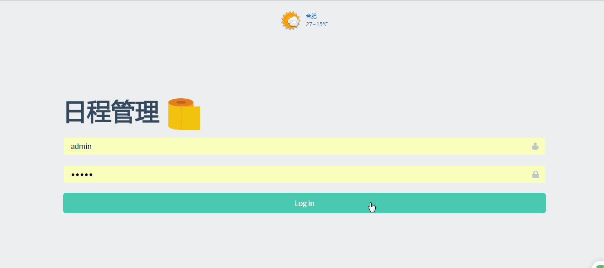

## 效果图

## 部署方式
1. 修改配置文件`数据库地址`以及`数据库名称`和`账号密码`
2. 在指定的数据库下执行`sql/fullcalendar.sql`文件
3. 搭建springboot项目
4. 启动
> 配置文件只有简单的配置数据源，因为没有做加密，所以就不上传了

## 使用说明
- 登陆:账号密码都是`admin`
- 左上角为`月`/`日程`视图切换，`按月查看`日程或者只显示`有日程的日期`
- 右上角查询功能为输入日程`名称` `模糊查询`相关日程，`点击`查询列表的`结果`，可以`跳转`至日程当天查看详情。
- 右上角新增事件功能为标准添加事件的入口，下面还会介绍快捷新增事件方式
- 快捷方式为：`直接点击`某一天的日期，或者`滑动选中`多天，新增表单会自动填充相关开始和结束日期，注意`循环事件`不支持结束日期，只能是`单日`的。
- 新增事件表单可提供`日程名称`，`日程开始时间`，`日程结束时间`，`活动城市`，`重复类型`，`日程类型`等选项，城市名称应填城市的`拼音`，`太长`的名称可以用`缩写`，如beijing可直接写bj。填写完即会显示城市当天天气以供参考。
- 日程类型分为`工作`、`生活`、`循环`三种，分别三种不同颜色区分。

## 设计框架
- 后端使用springboot + jpa + mysql
- 前端使用html + jquery + bootstrap + fullcalendar
- 前后动通信采用post方式请求和json数据传参

## 数据库设计
因为需要后端进行存储的数据不多，数据库根据功能只需要设计两个表
- User

| 字段名   | 类型    | 长度 | 主键 | 外键 | 可空 | 说明 |
|----------|---------|------|------|------|------|------|
| id       | int     | 12   | Y    | N    | N    | id   |
| username | varchar | 12   | N    | N    | N    | 账号 |
| pass     | varchar | 12   | N    | N    | N    | 密码 |
| nickname | varchar | 12   | N    | N    | N    | 昵称 |
- userevents

| 字段名     | 类型    | 长度 | 主键 | 外键 | 可空 | 说明     |
|------------|---------|------|------|------|------|----------|
| id         | int     | 12   | Y    | N    | N    | id       |
| userId     | int     | 12   | N    | Y    | N    | 用户id   |
| title      | varchar | 12   | N    | N    | N    | 标题     |
| eventType  | varchar | 12   | N    | N    | N    | 事件类型 |
| repeatFlag | bit     | 1    | N    | N    | N    | 重复标志 |
| repeatType | varchar | 6    | N    | N    | N    | 重复类型 |
| start      | varchar | 10   | N    | N    | N    | 开始时间 |
| end        | varchar | 10   | N    | N    | N    | 结束时间 |
| city       | varchar | 6    | N    | N    | N    | 城市     |